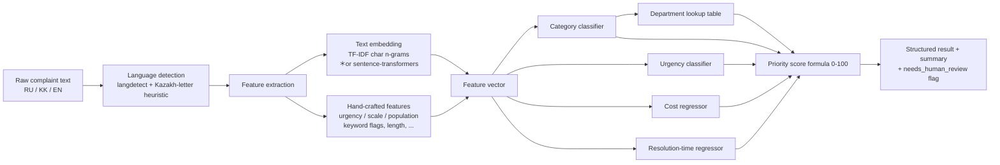

# 🏙️ Blockait — Citizen Complaint Classifier & Router for Astana

**Blockait** · built for the **SmartScape AI-for-Smart-Cities Hackathon (48h)** · An end-to-end machine-learning
prototype that reads a free-text citizen complaint (Russian / Kazakh / English) and
automatically **classifies it, routes it to the right akimat department, estimates
the cost and time to fix it, and assigns a 0–100 triage priority** — so a city
operator sees the most important issues first.

> Type *“Возле школы №25 не работает уличный фонарь, вечером темно и опасно для детей”* →
> **Streetlight · Critical urgency · Астана Жарық · ~163 000 ₸ · ~4 days · priority 84/100** —
> while a generic *“neighbours playing loud music”* scores just **~33/100**. And
> *“a car hit a pedestrian”* is correctly routed as a **traffic_accident → police + ambulance**.

---

## 1. Problem statement & real-world context

Astana's residents already report city problems through two real e-government channels:

- **iKOMEK 109** — the Astana akimat's **single 24/7 contact center**, which unifies all
  utility call-centers into one point of contact. Every appeal is registered, assigned a
  tracking number, and routed to the responsible state body/utility for resolution within
  set timeframes. Its stated goal is to resolve up to **90 % of residents' issues remotely**.
- **eOtinish (eotinish.kz)** — Kazakhstan's **national unified portal for citizens' appeals**
  to government bodies, providing a standardized register-and-track mechanism.

These systems receive **large volumes of unstructured, multilingual free text**. A human
operator must read each message, decide the category, pick the department, judge urgency,
and prioritize. **Blockait automates exactly that triage step** — turning raw text into a
structured, ranked, routable work item in milliseconds, while keeping a human in the loop
for low-confidence cases.

> **Why this matters:** faster, consistent triage → emergencies (a burst water main, an
> exposed live wire near a school) surface immediately instead of waiting in a flat queue.

---

## 2. What the system outputs

For every complaint, `classify_complaint(text)` returns:

| Output | How it's produced |
|---|---|
| **Category** (15 classes) | Trained multi-class classifier |
| **Urgency** (critical / high / medium / low) | Trained classifier + safety floor for emergency categories |
| **Department** (Astana akimat / emergency body) | Deterministic lookup from category *(honest — routing rules ARE deterministic in real municipal systems)* |
| **Estimated cost (KZT)** | Trained regressor, clamped to the category's realistic range |
| **Estimated resolution time (days)** | Trained regressor, clamped to the category's realistic range |
| **Priority score (0–100)** | Transparent, interpretable weighted formula |
| **Confidence + `needs_human_review`** | Classifier probabilities; flagged below threshold |

**Two honest guardrails make the estimates trustworthy:**
- **Range clamp** — the cost/time regressors are clamped to each predicted category's
  empirical **p2–p98** range (`models/category_ranges.json`), so a same-day medical emergency
  can't be reported as "8 days" via regression-to-the-mean.
- **Urgency safety floor** — `fire`, `medical_emergency` & `gas_leak` are forced to
  **critical**, `traffic_accident` to at least **high**, and explicit life-threat cues
  (murder / shooting / gas leak / "unconscious") force critical regardless of category.
  No dispatcher treats a fire as "low"; this is a transparent domain rule layered on the ML
  (and an overridden case is flagged for review).

**20 categories** — municipal *and* public-safety/emergency:
`pothole · streetlight · garbage · water_sewage · noise · illegal_construction ·
public_transport · park_landscaping · heating_utilities · snow_ice · power_outage ·
parking_violation · elevator · traffic_accident · crime · fire · gas_leak ·
medical_emergency · stray_animals · other`.

Emergency categories (`traffic_accident`, `crime`, `fire`, `gas_leak`, `medical_emergency`)
route to the relevant emergency service (police **102**, fire/ДЧС **101**, ambulance **103**,
gas **104**) — so a "car hit a pedestrian", "building is on fire", or "smell of gas in the
entrance" is recognized as the critical incident it is, instead of being forced into a
municipal bucket.

---

## 3. Architecture



Plain-text version:

```
text ─► language detect ─► [embedding ⨁ engineered features] ─┬─► category ─► department (lookup)
                                                              ├─► urgency
                                                              ├─► cost (KZT)
                                                              └─► resolution time (days)
                                                                        │
                          urgency + population + cost + speed ──► PRIORITY SCORE (0–100) ─► ranked triage queue
```

**Files**

| File | Role |
|---|---|
| `keywords.py` | Single source of truth: categories, department routing table, curated multilingual keyword lists |
| `data/generate_dataset.py` | Reproducible synthetic dataset generator (Step 1) |
| `features.py` | Multilingual preprocessing + feature extraction (Step 2) |
| `train.py` | Trains & evaluates all models, saves artifacts (Step 3) |
| `pipeline.py` | `classify_complaint(text) -> dict` inference pipeline (Step 4) |
| `app.py` | Streamlit demo: single / batch / metrics tabs (Step 5) |

---

## 4. Setup & run

> Requires Python 3.9+. The default backend is **TF-IDF** — lightweight, no downloads,
> fully offline. The trained models are committed, so you can skip straight to the demo.

```bash
# 1. install (≈1 minute, no model downloads)
python -m venv .venv && source .venv/bin/activate
pip install -r requirements.txt

# 2. (optional) regenerate data + retrain from scratch
python data/generate_dataset.py     # -> data/complaints_dataset.csv (+ train/test split)
python train.py                     # -> models/*.joblib + models/metrics.json

# 3. run the demo
streamlit run app.py
```

**Optional semantic-embedding backend** (sentence-transformers, heavier):

```bash
pip install -r requirements-sbert.txt
BLOCKAIT_BACKEND=sbert python train.py     # retrains on multilingual embeddings
```

---

## 5. Synthetic data methodology *(and its limitations — stated honestly)*

No public, labelled corpus of Astana complaints exists (iKOMEK / eOtinish data is not
openly released), so we **generate** one with a documented, reproducible procedure
(`data/generate_dataset.py`, fixed seed = 42, **≈3 400 samples across 20 categories** ·
RU 1666 / KK 866 / EN 862):

1. **Sample** a category, language (RU 50 % / KK 25 % / EN 25 %), urgency (from a
   category-conditioned prior), and scale (single / multiple / widespread).
2. **Compose** the text from category- & language-specific templates, **injecting** the
   curated urgency, scale, and location/landmark phrases from `keywords.py`. The injected
   phrases deliberately contain the same keywords the model later uses as features — this
   is what creates a *genuine, learnable* signal rather than random noise.
3. **Derive** the continuous targets (`cost_kzt`, `resolution_days`) from a per-category
   base **triangular** distribution (stated min/max range, mass near typical values) scaled
   by urgency- and scale- multipliers + random noise, so targets are internally consistent
   with the text (e.g. a *widespread* water issue becomes a *critical* main-break with high
   cost but fast 1–3 day response).
4. **Add realistic noise:** typos, abbreviations (`улице → ул.`), casing, sarcasm, missing
   detail, mixed-language fragments.

**Limitations (important):**
- Synthetic ≠ real distribution. Real complaints are messier, more ambiguous, and contain
  slang/code-switching our templates only approximate.
- Cost/time labels are **plausible heuristics**, not audited municipal figures → the
  regressors learn our assumptions, not ground-truth budgets.
- Template structure means lexical cues are stronger than in the wild, which inflates
  classifier accuracy somewhat. The honest headline metric is the **methodology**, not the
  absolute numbers — see *Path to production* for how real data changes this.

---

## 6. Model performance

Stratified 80/20 split · **2 715 train / 679 test** · default **TF-IDF** backend
(1500 char n-gram features + 15 hand-crafted features = 1515 dims). Model is auto-selected
per task by 5-fold cross-validation on the training set; metrics below are on the **held-out
test set**.

| Task | Model (auto-selected) | Metric | Score |
|---|---|---|---|
| **Category** (20-class) | RandomForest | Accuracy / macro-F1 | **0.990 / 0.989** |
| **Urgency** (4-class) | RandomForest | Accuracy / macro-F1 | **0.903 / 0.904** |
| **Cost** (KZT) | RandomForestRegressor | MAE / R² | **≈190 000 ₸ / 0.31** |
| **Resolution time** (days) | RandomForestRegressor | MAE / R² | **≈3.7 days / 0.38** |

Candidates compared for each task: *Logistic Regression, Random Forest, MLP* (classifiers);
*Gradient Boosting, Random Forest* (regressors, log-target). Full per-class precision/recall/
F1 and confusion matrices are printed by `train.py` and shown in the demo's **Metrics** tab.

**On the regressors' modest R²:** cost & time are inherently high-variance *estimates* — by
design the synthetic targets carry a wide within-category random component, so R² is capped.
**MAE is the operational metric** (a ±6-day / ±200k-KZT ballpark is useful for triage), and a
moderate, honestly-reported R² beats an overfit one.

> On this synthetic set TF-IDF slightly **out-performs** the sentence-transformer backend
> (the templates are lexically separable). Semantic embeddings are expected to generalize
> better on real free-form text, which is why they remain a one-flag option.

---

## 7. Priority score — a transparent, explainable formula

We deliberately use an **interpretable formula, not a black box**. For a government system
that must justify how it ranks citizens' issues, explainability is a **feature**, not a
compromise — every complaint's score can be decomposed and defended.

```
priority(0–100) = 100 · ( 0.40 · U                 # urgency        — safety first
                        + 0.25 · P                 # population      — who is affected
                        + 0.20 · Ce                # cost-efficiency — impact PER cost
                        + 0.15 · (Speed · U) )     # quick wins that are ALSO urgent
```

| Term | Definition | Intuition |
|---|---|---|
| `U` urgency | low .15 / medium .45 / high .75 / critical 1.0 | life-safety dominates |
| `P` population | `min(Σ population-keyword weight / 2, 1)` (school, hospital, playground…) | more / more-vulnerable people affected → higher |
| `Ce` cost-efficiency | `impact · (1 − min(cost/2 000 000, 1))`, `impact = max(U, P)` | cheap **and impactful** fixes rank up; cheap-but-trivial gets no free ride |
| `Speed` | `1 − min(days/30, 1)` | quick fixes rank up — **but only when urgent** (gated by `U`) |

Weights sum to 1.0; every term is normalized to [0,1]; the full breakdown is returned in the
API and shown in the UI. **Sanity check (built in):** *“broken streetlight near a school”*
→ **≈84/100**, far above a generic *“neighbours playing loud music”* → **≈33/100**. ✔

A prediction is flagged **`needs_human_review`** when category confidence < 0.50 or urgency
confidence < 0.40 — keeping a human in the loop exactly where the model is unsure.

---

## 8. Path to production

What changes when this meets **real** Astana data:

1. **Data source.** Replace the synthetic set with historical iKOMEK 109 / eOtinish appeals
   (text + final category + assigned department + actual resolution time + actual cost from
   utility records). Re-train — the *entire pipeline already works*, only the CSV changes.
2. **Labels become ground truth.** Cost/time regressors would learn from real closed-ticket
   budgets and SLAs instead of our heuristics, sharply improving R².
3. **Embeddings.** Switch to the **sentence-transformers** backend (one flag) for better
   generalization to messy real text; optionally fine-tune or distill on Kazakh.
4. **Kazakh-language support.** langdetect has no Kazakh model (we use a letter heuristic).
   Production should add a proper Kazakh language-ID + a Kazakh-aware tokenizer/embedding,
   and balance the training set across languages.
5. **Integration.** Expose `classify_complaint()` behind a small REST API; iKOMEK could call
   it at intake to pre-fill category/department and surface the **priority-ranked triage
   queue** to dispatchers. Department routing stays a maintained lookup table (auditable).
6. **Feedback loop & monitoring.** Log operator corrections → continuous re-training; monitor
   per-category drift; periodically re-validate the priority weights with the akimat.
7. **Governance.** Keep the priority formula transparent and the human-review gate; add
   geocoding from the free-text location to populate real district/affected-population data
   instead of keyword heuristics.

---

## 9. Team / credits

- **Built for:** SmartScape — AI-for-Smart-Cities Hackathon (48-hour challenge).
- **Use case:** Astana (Kazakhstan) municipal complaint triage, modeled on the real
  **iKOMEK 109** and **eOtinish** channels.
- **Stack:** Python · scikit-learn · sentence-transformers (optional) · langdetect ·
  Streamlit · Plotly.
- **ML contribution:** custom feature-engineering layer + downstream classifier/regressor
  heads + the interpretable priority-scoring system (no unmodified pretrained model makes the
  final decisions; any embedding model is used only as a frozen feature extractor).
- **Data:** 100 % synthetic, generated by `data/generate_dataset.py` (reproducible, seed 42).

> ⚠️ Disclaimer: a hackathon prototype on synthetic data. Not affiliated with the Astana
> akimat, iKOMEK, or eOtinish; cost/time figures are illustrative estimates.

**Sources for the real-system context:**
[iKOMEK 109 (Astana)](https://www.ikomekastana.kz/eng/index.html) ·
[iKOMEK — about](http://109.astana.kz/ru/ikomek/about) ·
[eOtinish — national appeals portal](https://eotinish.kz)
